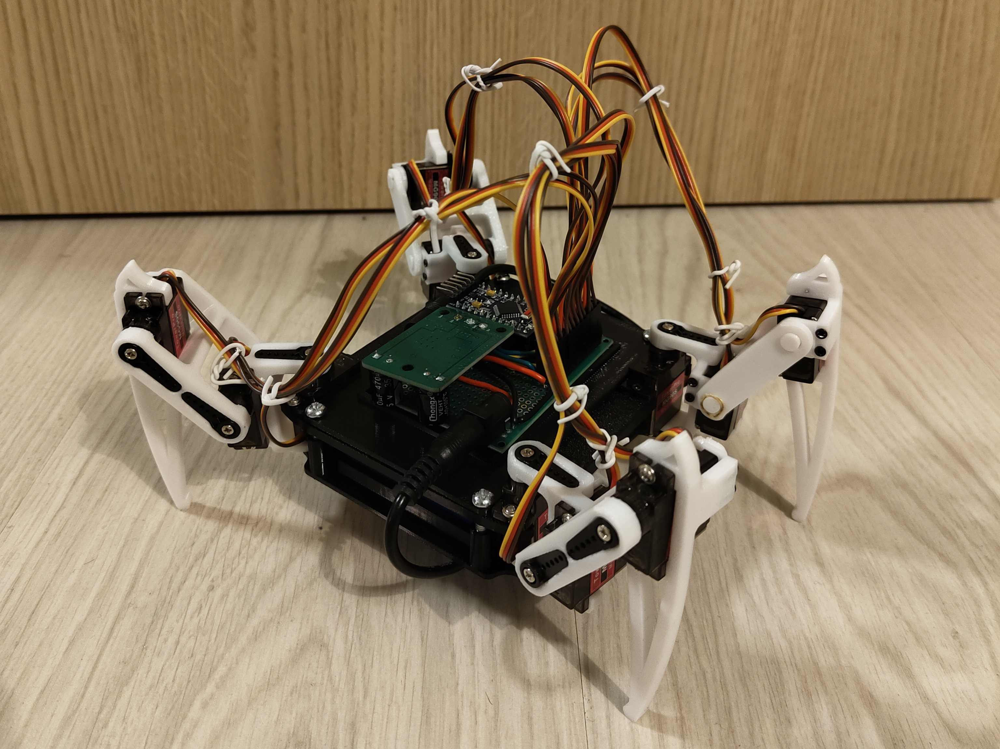

# SpiderBot - Quadruped Robot Project

A quadruped (4-legged) crawling robot with 12 servo motors, featuring custom PCB design with STM32L412KBT6 microcontroller. This project combines inverse kinematics control with professional embedded hardware design.

## 🤖 Overview

This robot features:

- **4 legs** with **3 servos each** (coxa, femur, tibia)
- **Inverse kinematics** for natural movement
- **Multiple gaits**: walking forward/backward, turning, sitting/standing
- **Demo movements**: hand waving, hand shaking, body dancing
- Real-time servo interpolation at 50Hz for smooth motion
- **Custom PCB** with STM32L412KBT6 microcontroller



## 🔧 Hardware

### Current Prototype

- **Microcontroller**: Arduino Pro 5V 16MHz (ATmega328P)
- **Servos**: 12x standard hobby servos
- **Power**: External 12.6V Li-Pol battery with DC converter
- **Communication**: Bluetooth module (optional & not yet implemented in code)

### Custom PCB Design (In Development)

I have been designing a custom PCB for the SpiderBot with significant improvements over the prototype:

- **Microcontroller**: STM32L412KBT6 (Cortex-M4, 80MHz)

  - 128KB Flash, 40KB SRAM
  - Low-power ARM architecture
  - Much more capable than the ATmega328P (only 2KB RAM)
  - Enables future features like advanced control algorithms and RTOS implementation

- **Power Management**:

  - Buck converter (L7986A) for efficient 3.3V generation from 12.6V Li-Pol battery
  - Supports up to 3A output current
  - 20% current ripple design with 9µH inductor
  - 10µF ceramic input capacitor
  - Linear voltage regulator (HT7533-1) for clean analog power
  - Supervisor IC (ST763A) for reliable system reset

- **Features**:
  - Integrated power regulation eliminates external DC converter
  - Proper PCB layout for servo control signals
  - Professional component selection and power supply design
  - Compact form factor for robot integration

The PCB design files are available in the `SpiderBotPCB/` directory (KiCad format), and design calculations can be found in `PCBDesignConsiderations/`.

## 💻 Software

- PlatformIO
- Libraries:
  - `Arduino.h`
  - `Servo.h`

## 🚀 Getting Started

1. **Clone the repository**

   ```bash
   git clone https://github.com/davidstrasak/SpiderBot.git
   cd SpiderBot/SpiderBot_Code
   ```

2. **Calibration** (Important!)

   - Before first use, calibrate the robot for accurate movement
   - See calibration instructions in the code header

3. **Build and upload**

   ```bash
   platformio run --target upload
   ```

## Movement Functions

- `stand()` / `sit()` - Basic postures
- `step_forward()` / `step_back()` - Walking gaits
- `turn_left()` / `turn_right()` - Rotation
- `body_left()` / `body_right()` - Weight shifting
- `hand_wave()` / `hand_shake()` - Demonstration movements
- `body_dance()` - Fun dance routine

## 📁 Project Structure

```
SpiderBot/
├── SpiderBot_Code/          # Arduino/PlatformIO firmware
│   ├── src/main.cpp         # Main control code with inverse kinematics
│   └── platformio.ini       # Build configuration
├── SpiderBotPCB/            # KiCad PCB design files
│   ├── SpiderBotPCB.kicad_sch
│   ├── SpiderBotPCB.kicad_pcb
│   └── Lib/                 # Component libraries (HT7533, L7986A, ST763A)
└── PCBDesignConsiderations/ # LaTeX documentation with design calculations
    └── DesignConsiderations.tex
```

## 📚 Learning Experience

This project was a learning experience in:

- Embedded systems programming
- Inverse kinematics implementation
- Real-time control systems
- Hardware-software integration
- Multi-servo coordination
- PCB design and power supply engineering
- Component selection and circuit analysis

## 🔧 Configuration

Key parameters can be adjusted in the code:

- Leg dimensions (`length_a`, `length_b`, `length_c`)
- Movement speeds (`leg_move_speed`, `body_move_speed`, etc.)
- Servo pin assignments
- Default positions and step sizes

## 📝 License

This project builds upon open-source robotics code. See the source file headers for attribution details.

## ⚠️ Notes

- Ensure adequate battery and DC converter for all 12 servos
- Print a good and tight enclosure for best results
- The custom STM32 PCB will enable more complex features in future versions
- The RTOS implementation is experimental on ATmega328P due to limited RAM (2KB)

---

**Built with**: PlatformIO • Arduino • C++ • KiCad • STM32 • Love for Embedded Systems 🦿
